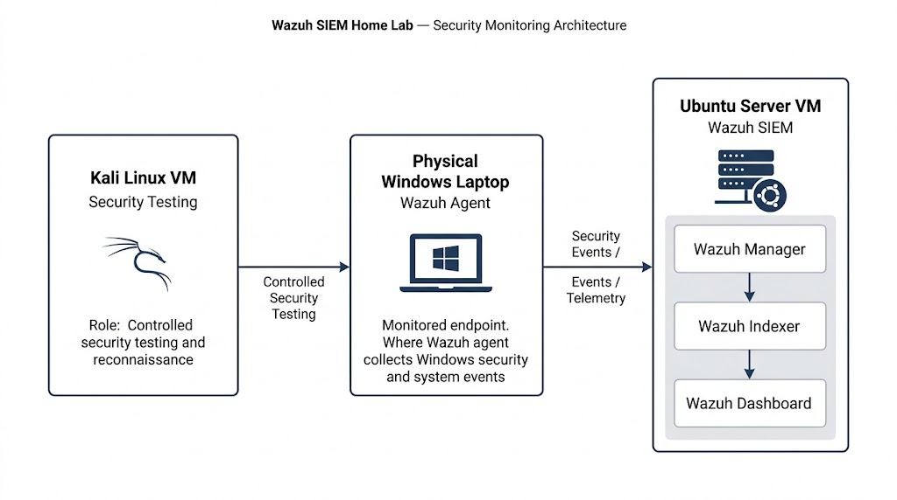

# Wazuh SIEM Home Lab

## Overview

A hands-on cybersecurity home lab implementing Wazuh as a centralized SIEM platform for monitoring a Windows endpoint, collecting security events, and analyzing activity generated during controlled security testing.

The lab was built using virtual machines and a physical Windows endpoint to simulate a small security monitoring environment.

## Objectives

- Deploy Wazuh as a centralized SIEM platform
- Configure endpoint monitoring with the Wazuh Agent
- Collect and analyze Windows security events
- Monitor authentication and audit activity
- Analyze application-related events
- Perform controlled security testing using Kali Linux
- Investigate security events through the Wazuh Dashboard
- Document the complete deployment and testing process

## Architecture



The lab consists of three main systems:

- **Ubuntu Server VM** — Wazuh Manager, Wazuh Indexer and Wazuh Dashboard
- **Windows Laptop** — monitored endpoint running the Wazuh Agent
- **Kali Linux VM** — controlled security testing machine

### Data Flow

```text
Kali Linux
(Security Testing)
       |
       | Controlled Security Testing
       v
Windows Laptop
(Wazuh Agent)
       |
       | Security Events / Telemetry
       v
Ubuntu Server
(Wazuh SIEM)
       |
       +-- Wazuh Manager
       |
       +-- Wazuh Indexer
       |
       +-- Wazuh Dashboard